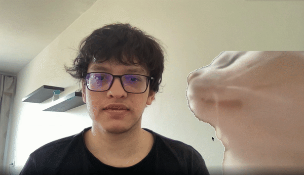

# virtual-camera-meme-filters
Overlay gifs of memes on your video calls (works with Zoom, Google Meet, Microsoft Teams)

<p align="center">
  
</p>

<p align="center">
  
</p>

## Installation guide

```
pip install -r requirements.txt
```
[PyVirtualCam](https://github.com/letmaik/pyvirtualcam) needs [OBS](https://obsproject.com/) if you're using Mac or Windows, or install [v4l2loopback](v4l2loopback) for Linux for virtual camera output. 

## Usage

```
python run.py --filter['cat' or 'pikachu' or 'rainbow_cat' or 'dog'] --position['top' or 'bottom'] --magnify[magnification factor eg: 2.3] --speed[0 for idle, eg : 2 will move it from right to left]
```
```
python run.py --filter cat
```
```
python run.py --filter pikachu --magnify 1.5 --speed 5
```
4 filter options - ['cat','pikachu','rainbow_cat','dog']

All filters have customized default settings but feel free to play with it!


Open up Zoom or Google Meet and choose OBS/v4l2loopback Virtual Camera 

If you're using Google Chrome and OBS virtual camera option is not avilable then disable hardware acceleration in chrome settings and restart.


## Future updates
Will add more memes (doge coming up next!)
